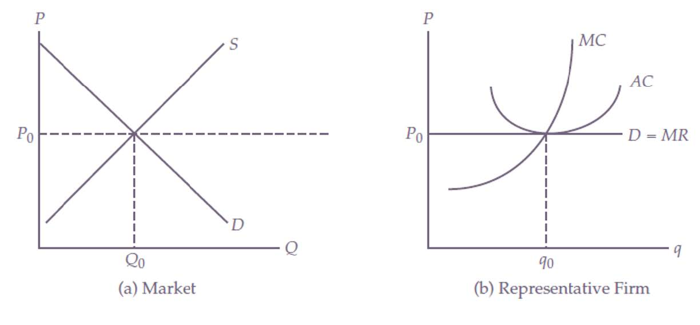
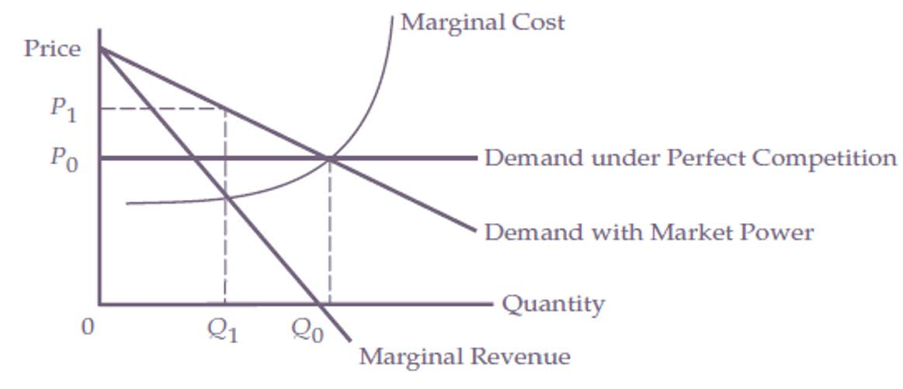
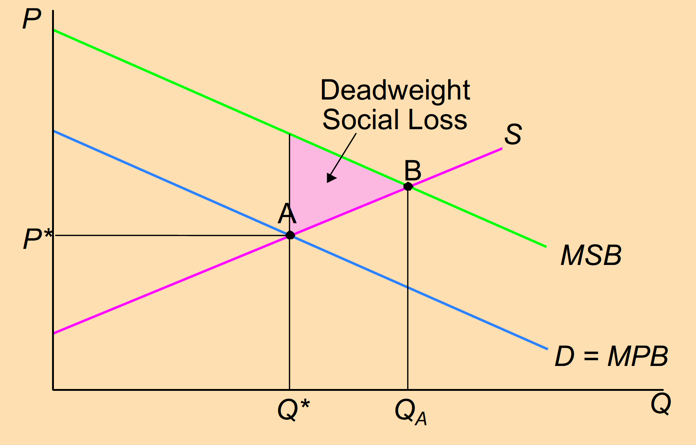
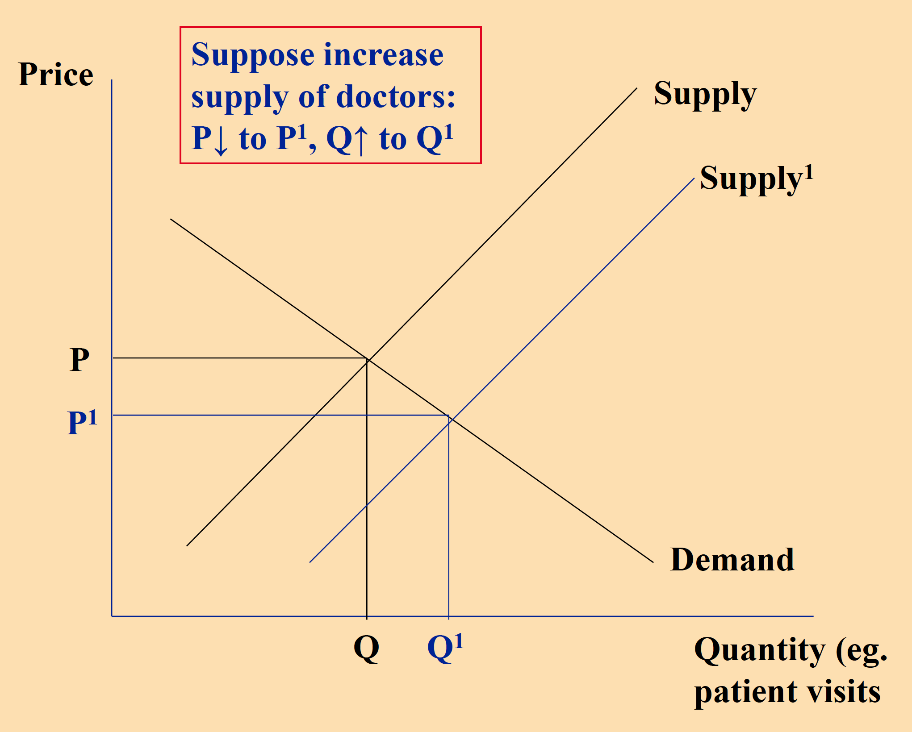
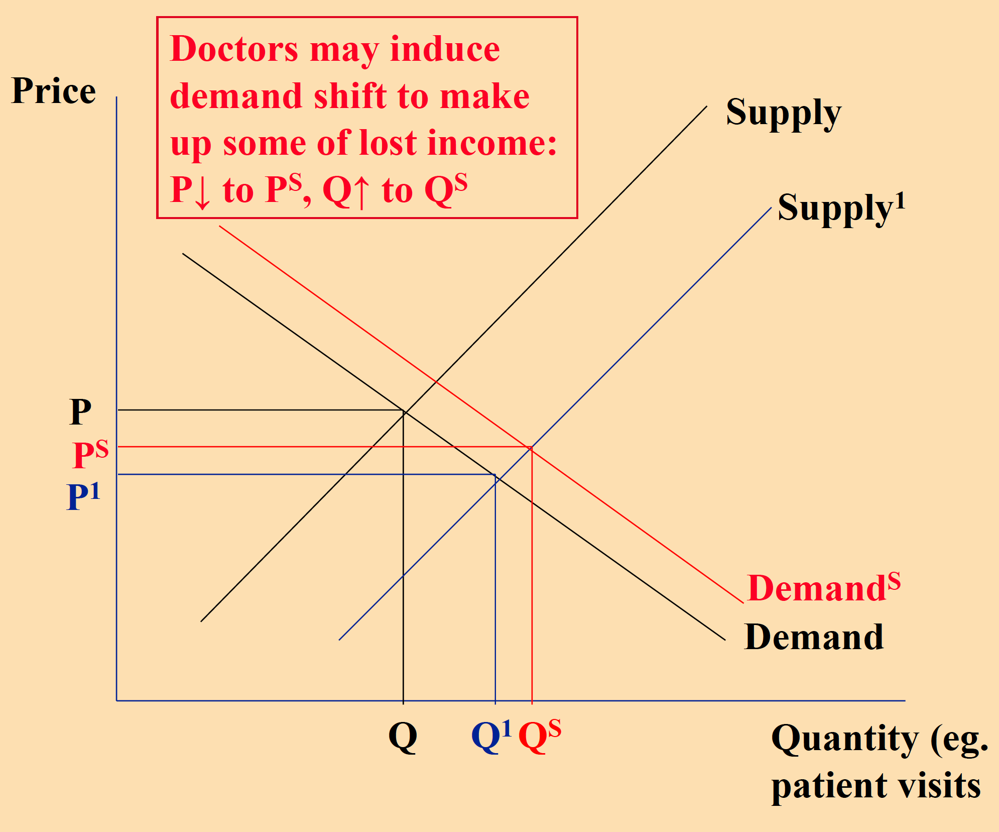
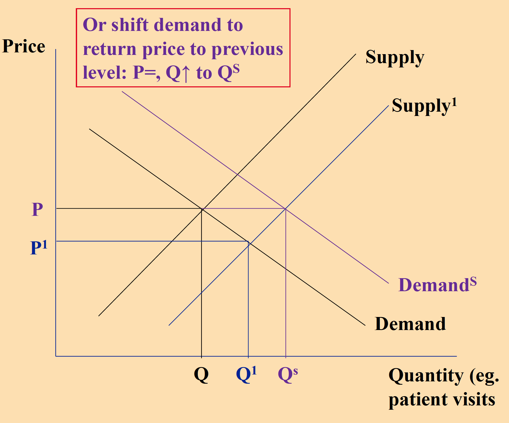
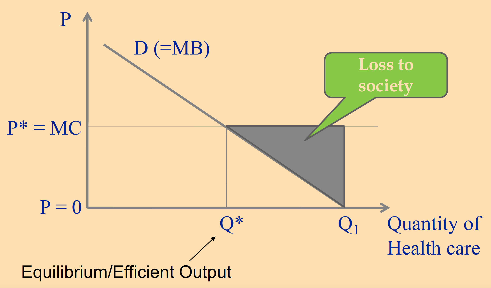
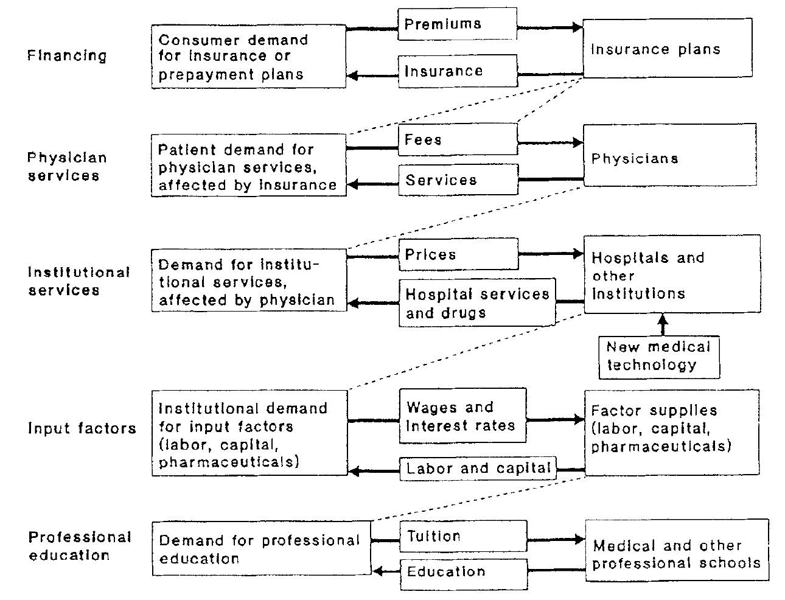
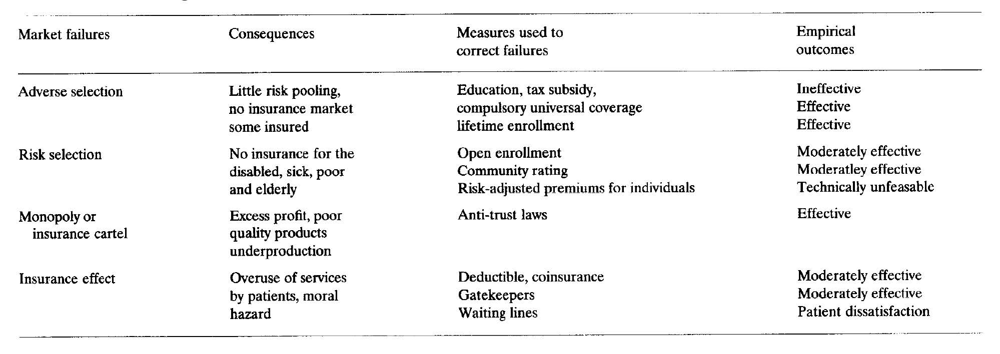
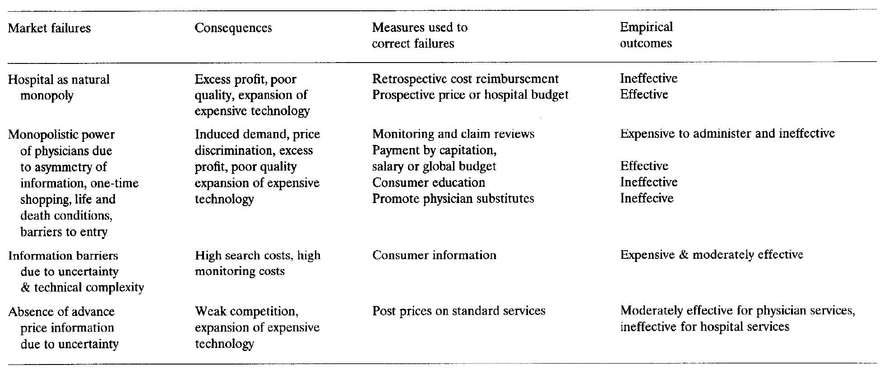

```{r setup, include=FALSE}
knitr::opts_chunk$set(warning = FALSE, message = FALSE, 
  comment = NA, dpi = 300,
  fig.align = "center", out.width = "80%", cache = FALSE)
library(Statamarkdown)
library(tidyverse)
library(xaringanExtra)
xaringanExtra::use_tile_view()
xaringanExtra::use_panelset()
xaringanExtra::use_scribble()
```


class: title-slide, center, middle, inverse

# `r rmarkdown::metadata$title`

<!--- ### `r rmarkdown::metadata$subtitle` --->

#### `r rmarkdown::metadata$author`

 

#### Department of Global Health

#### `r rmarkdown::metadata$institute`

### `r rmarkdown::metadata$date`

---
# Demand and supply

.pull-left[
- Law of demand 

- Factors shifting the demand curve 

  - Income 
  
  - Price of related goods 
  
  - Tastes 
  
  - Expectations 
  
  - Number of buyers ...

- Price elasticity: measuring the responsiveness of demand to price change

]

.pull-right[

- Law of supply

- Factors shifting the supply curve

  - Input price 
  
  - Tchnology
  
  - Expectation 
  
  - Number of sellers ...

]
---
# Competitive markets 

.pull-left[

Conditions of competitive market 

- Producers

  - Face competition
  
  - Face no barriers to entry or exit 

- Consumers: 
  
  - Are .red[perfectly informed] of benefits and prices of all goods
  
  - Bear all costs and receive all benefits (No .red[externalities])
  
- There are no 'public Good' characteristics 

- Products are identical (price is only factor)

]

.pull-right[

```{r echo=FALSE, out.width="100%"}
dta1 <- data.frame(x = c(0,0,50,0), y = c(0,400,400,0))

supply1 <- ggplot(data.frame(x=c(0,100)),aes(x=x)) + 
  annotate("segment", x = 0, xend = 100, y = 0, yend = 800) + 
  scale_y_continuous(limits = c(0,800), breaks = seq(0, 800, by = 100)) +
  labs(x = "Quantity", y = "Price") +
   theme_classic() +
  theme(text = element_text(size=25),axis.ticks.length = unit(-2, "mm")) 

dta2 <- data.frame(x=c(0,0,50),y=c(400,600,400))
equi1 <- supply1 +
  annotate("segment", x= 0 , xend= 100 , y= 600 , yend = 200, color = "red")   + 
  annotate("text", x = 100, y= 700, label = "S", size =8) +
  annotate("text", x = 100, y= 150, label = "D", size =8)

equi1 +
  annotate("segment", x=0, xend=50, y=400, yend=400, linetype = 2, color="red") +
  annotate("segment", x=50, xend=50, y=0, yend=400, linetype = 2, color="red") +
  geom_polygon(aes(x, y), data=dta1, fill = "red", alpha = 0.2) +
  geom_polygon(aes(x, y), data=dta2, fill = "purple", alpha = 0.2) +
  theme(axis.text.x=element_blank(),
      axis.text.y=element_blank())

```

]
---
# Competitive markets: Market vs. individual firm 

<center> 



### As a result firms and consumers are market .red[price takers]

### Under the competitive market, it reaches .red[efficiency] 

---
# Condition of perfectly competitive market 

.pull-left[

- Many buyers and sellers

- A standardized product (private goods)

- Mobile resources (free enter and exit the market)

- Perfect information
]

.pull-right[

### Efficient market presented in health care?

- Lack of competition (monopoly, oligopoly)

- Goods characteristics

  - Externalities

  - Public Goods

- Uncertainty (insurance market, payment models)

- Imperfect information (e.g.,supplier induced demand, moral hazard and adverse selection) 

- Barriers to entry
]
---
# Government intervention to address market failure 

1. Regulations

  - e.g., Price control 

2. Financial incentives 

  - Taxation 

  - Subsidy 

---
# Some favor government involvement in medical care 

- Medicine is too .red[complicated] to be left to market forces

- Medicine difficult to understand; patents must rely on .red[doctors]

- Medical care is a .red[social good], too important for the impersonal marketplace

- .red[Externalities] in medicine, especially infectious diseases, require collective action to protect society

- Provision of medical care based on the ability to pay is .red[morally repugnant]
---
# Some oppose government involvement in medical care

- U.S. system has remained mostly market-based

- This is evidence of deep American distrust of federal government involvement in health care matters

- Experience: government-run programs are .red[costly]

---
# Market failure

.pull-left[

> Markets fail to allocate resources optimally when firms have .red[market power], when there
are .red[externalities] in consumption and production, and when the good produced is a .red[public good].

> Market power: Market power is depicted graphically by any .red[departure] from perfectly elastic demand curves

]

.pull-right[

<center> 



] 

---
# Market failure in medical markets

.pull-left[

- Lack of competition (monopoly, oligopoly)

- Goods characteristics

  - Externalities (merit goods)

  - Public goods

- Uncertainty (insurance market, payment models)

- Imperfect information (e.g.,supplier induced demand, moral hazard and adverse selection) 

- Barriers to entry
]

.pull-right[


]

---

# Market failure 1: Public goods 

.pull-left[

Definition: A public good is ‘a good or service that can be consumed simultaneously by everyone
and from which no individuals can be excluded'.

  - non-rival 
  
  - non-excludable
]

.pull-right[

Is health care a public goods? why or why not

]
---
# Market failure 2: Monopoly 

.pull-left[

<center> 


]

.pull-right[

### Government interventions

  - Regulations 
  
    - Price controls 
    
    - Entry restrictions 
    
    - Limits on new product development 
    
  - Tax policy 

]

---
# Subsidy to vaccination

<center> 

<iframe width="950" height="495" src="https://www.youtube.com/embed/Aqlk5OptiZM" title="Subsidies to encourage more Singaporeans to get vaccinated" frameborder="0" allow="accelerometer; autoplay; clipboard-write; encrypted-media; gyroscope; picture-in-picture; web-share" referrerpolicy="strict-origin-when-cross-origin" allowfullscreen></iframe>

---
# Market failure 3: Externalities 

- Definition: An externality is a .red[cost] or a .red[benefit] arising from an economic transaction that
falls on people who do not participate in the transaction

- A benefit in this case is called a .red[positive externality] or .red[external benefit].

- A cost is called a .red[negative externality] or external cost.

- Policy issue – design of appropriate institutions, legislation and regulation to align individual
incentives and social welfare

---
# Postive externality 

- Private benefit

  - .red[Direct benefit] to .red[consumers] who buy and consume good

- Social benefit
  
  - .red[Indirect benefit to all] in society, including those who do not consume it
  
      - Vaccination (herd immunity effect)
      
      - ‘Caring externality’ – others in society care that other people might not be able to receive treatment
      
  - Cause market failure (too little consumption)
    
      - Demand curve = ‘marginal private benefit’ (MPB)
  
      - But, where positive externalities exist, additional ‘marginal social benefits’ (MSB)
        
---

# Externality leads to market failure 

.pull-left[

### Why? 

-  Where externalities exist, the price mechanism does .red[not] result in allocative efficiency, therefore market failure.

- With positive externalities people that would benefit are not buying the product

- Therefore there is under supply of product and .red[‘deadweight'] social loss

### Government interventions 

  - Subsidy/Tax 
  
  - Regulations of quantity produced 
]

.pull-right[

<center> 



]
---
# Hospital Price Transparency Rule

<center> 

<iframe width="950" height="495" src="https://www.youtube.com/embed/xVlIa7bWfGw" title="Understanding the Hospital Price Transparency Rule" frameborder="0" allow="accelerometer; autoplay; clipboard-write; encrypted-media; gyroscope; picture-in-picture; web-share" referrerpolicy="strict-origin-when-cross-origin" allowfullscreen></iframe>

---
# Market failure 4: Asymmetry of information

- Definition: 

  - .red[Asymmetry of information] exists when one person in an economic transaction has more relevant information than the other person. 

- In health care settings, asymmetry of information raises three issues: 

- In the medical care market, it leads to 

  - .red[Supplier-induced demand]; 

- in the health insurance market, it leads to 

  - .red[Adverse selection]
  
  - .red[Moral hazard]

---
# Supply induced demand 

.pull-left[

- Definition: Increased .red[demand] as a result of a provider (e.g. a doctor) exploiting
an asymmetry of information. 

  - More generally, observation that when faced with shock to equilibrium (e.g., .red[increase supply]), health providers may respond by .red[‘inducing demand’] (shift demand curve) for their services

- It is also an agent problem

  - In practice, health providers (like other human beings!) are not perfect at putting the interests of others before their own .red[interests]

- Why does it lead to inefficiency: 

  - .red[Unnecessary use] of medical services for consumers
]

.pull-right[

.panelset[.panel[.panel-name[Supply+]

<center> 



]

.panel[.panel-name[Demand+]

<center> 



]

.panel[.panel-name[Supply++]

<center> 



]
]
]
---
# Moral hazard 

.pull-left[

- Definition: Moral hazard occurs anytime there is an opportunity to gain from acting differently
from the implied principles of a contract

  - .red[The contract changes consumer’s behaviors]

- Because private actions are hidden from view, both parties have an opportunity to gain from unpredictable behavior

- Having insurance:

  - Increases the likelihood of purchasing medical services
  
  - Induces higher spending in the event of illness
]
  
.pull-right[

### Potential loss from moral hazard

<center> 


]
---
# Moral Hazard 

<center>

<iframe width="850" height="495" src="https://www.youtube.com/embed/keOJX7JObvI" title="Health Care Economics:  Ankle MRI" frameborder="0" allow="accelerometer; autoplay; clipboard-write; encrypted-media; gyroscope; picture-in-picture; web-share" referrerpolicy="strict-origin-when-cross-origin" allowfullscreen></iframe>

---
# User fees and moral hazard 

.pull-left[

 - User charges (co-payments) can be viewed as a means of reducing moral hazard

  - Reduces utilization of health care by patients

- But there are problems:

  - Disproportionately affects lower income groups

  - Demand is reduced for effective treatments as well as trivial health care

  - May not reduce consumption if doctors induce demand
]

.pull-right[

<iframe width="450" height="300" src="https://www.youtube.com/embed/kAKQ6TYzc-I" title="Why user fees won&#39;t make our health system more affordable, featuring Dr. Raisa Deber" frameborder="0" allow="accelerometer; autoplay; clipboard-write; encrypted-media; gyroscope; picture-in-picture; web-share" referrerpolicy="strict-origin-when-cross-origin" allowfullscreen></iframe>

]
 
---

# Adverse selection 

.pull-left[
- Adverse selection arises because

  - Individuals may have .red[better information] of their risk status than does the insurance company

  - Individuals with a low risk of requiring health care may find it difficult to obtain ”actuarially fair” insurance – premium equal to expected cost of future consumption

  - Those with .red[lower risk] will .red[not purchase insurance] priced to cater for those with
average risk, whereas higher risk individuals will, SO…
]

.pull-right[

- … average risk level of those remaining will
rise (as will premium) (continually)

- Result: those at .red[low risk] (and high risk with
low income) .red[not insured] (as premium rises)

- Solutions:

  - Private insurance may .red[‘experience rate’] (set a
different premium for different risk groups)

  - Compulsory .red[public insurance]. Stops low risk
leaving market (forced cross-subsidisation of
those at high risk by those at low risk)
]
---
class: middle center inverse 

# Abnormal economics in the health sector

### William Hsiao
---
# Three types of goods 

- Public goods: .red[Non-exclusive] and/or .red[non-rival] in consumption

  - Example: Defense, public infrastructure, clean water

- Merit goods: A good which when consumed provides external benefits, although
these may not be fully recognised

  - Services whose consumption produces .red[greater social benefits] than private benefit, such as
family planning

  - Services producing .red[externalises], such as vaccination

  - Services possessing significant .red[interpersonal utility values], emergency services for trauma patients

  - Services where individuals .red[lack sufficient education or rationality] to make rational
consumption decision, such has .red[preventive services]

- Private goods: Services that .red[exclusively] benefit the persons who consume them and
that if consumed by one person, can’t be consumed by another(.red[rival]).
---
# Five markets

<center>



.red[Interaction] among the markets in the health sector
---
# The financing markets for health care

- .red[Uncertainty] and .red[high medical costs] demands health insurance

- Market failures in health financing and consequences

.pull-left[

- .red[Adverse selection] by consumers

  - Spiral dead end with no stable
insurance market

  - Discourage risk pooling: low premium
for low-risk population and high
premium for high-risk population

- .red[Risk selection] by insurance companies

  - Exclude high-risk individuals from the
health insurance

]

.pull-right[

- .red[Barriers to entry] into health insurance
industry

  - Monopolistic practices
  
- .red[Moral hazard]: Distortion in consumers’
demand for health services due to
insurance

  - Overuse of health services

  - Increase health expenditure

]
---
# Market failure in financing and correction measures

<center>



---
# The market failure for clinical services

- Asymmetry of information between patients and physicians

  - High search costs, and high monitoring costs

- Inperfect agency

  - Induced demand, overuse of expensive technology and drugs, excessive profit for
physicians

- Monopolistic power (e.g. life-threatening and emergency conditions)

- Absence of advance price information
---
# Market failure in health services and correction measures

<center>



---
# Lessons for developing countries

- Commercial insurance market

  - .red[Regulation] (e.g. subsidies) has proven to be largely .red[ineffective] and .red[costly] in correct failures in the Private insurance market

- Clinical service market

  - Clinical-service market failure can be corrected through .red[price and quantity regulations]:
  
      - capitation and 
    
      - prospective budgets

---
class: middle, center, inverse

# .large[Thank you!]